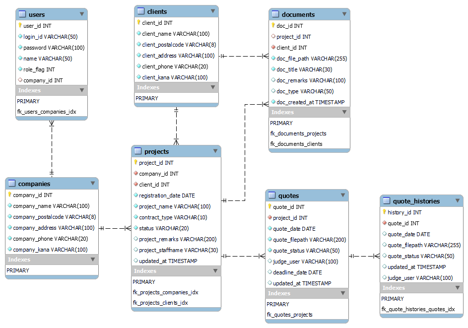
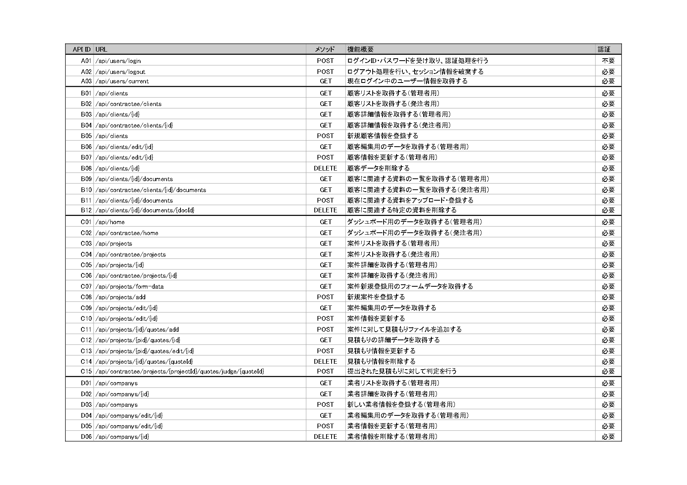

# BMS Systemフロントエンド

## セットアップ手順

### 前提環境

- Node.js（LTS版）
- JDK 21（Pleiades等でインストール済みであること）
- MySQL Workbench / MySQL Server（ローカルにインストール済みであること）

### データベースのセットアップ

1. MySQL Workbenchを開く
2. `bms-systemDB.sql` を開く（File → Open SQL Script）
3. スクリプトを実行する（稲妻アイコンをクリック）
   → `project_system_db` データベースとテーブル、初期データが自動で作成されます。

### データベース接続設定
プロジェクトルート（`bms-frontend/`）直下にある `application.properties` の以下の値を、お使いのMySQL Workbench環境に合わせて書き換えてください。

```
spring.datasource.url=jdbc:mysql://127.0.0.1:3306/project_system_db?useUnicode=true&characterEncoding=utf8&serverTimezone=Asia/Tokyo
spring.datasource.username=root
spring.datasource.password=（各自のMySQLパスワード）
spring.datasource.driver-class-name=com.mysql.cj.jdbc.Driver
```

### VSコード内でのセットアップ手順

#### 1. Node.jsのインストール確認

```
node -v
```

インストールされていない場合は、公式サイト(https://nodejs.org/)からLTS版をインストールする。

#### 2. 依存関係のインストール

このフォルダ(`package.json`がある場所)で以下を実行する。

```
npm install
```

初回は`node_modules`フォルダが作られ、必要なツール（axios, jotai, react, react-dom, react-router）が自動でインストールされます。


#### 3. 開発サーバーの起動

##### バックエンド

control＋＠でターミナルを開き、バックエンドのJARファイル（`BMS-Backend-0.0.1-SNAPSHOT.jar`）を実行します。

```bash
java -jar BMS-Backend-0.0.1-SNAPSHOT.jar
```

起動後、`http://localhost:8080`（ポート番号は実際の設定に合わせて変更）でAPIが待ち受けます。

<details>
<summary>実行時Javaが見つからないエラーが出る場合（Windows）</summary>

1. Windowsキーを押して「システム環境変数の編集」と検索して開く
2. [環境変数] ボタンをクリック
3. `Path` を探してダブルクリック（または「編集」）
4. 既存のJava21があれば「上へ」で一番上に移動する
5. なければ、Pleiadesのjavaフォルダ内の`21`（jdk-21等）フォルダの`bin`フォルダのパスを新規追加する
   （例: `C:\Users\あなたのユーザー名\pleiades\2024-03\java\21\bin`）
</details>

##### フロントエンド

```bash
npm run dev
```

起動後、表示されたURL（例: `http://localhost:3000`）にブラウザでアクセスしてください。


### 動作確認の手順

1. `BMS-Backend-0.0.1-SNAPSHOT.jar`でバックエンドを起動する
2. `npm run dev`でフロントエンドを起動する
3. ブラウザで`http://localhost:3000`を開く
4. ログイン画面で「管理者ID:admin PASS:aaaまたは発注業者ID:ks_narita PASS:bbb」でログイン
5. 各フォームを操作し実際の動きを確認する

※ID及びPASSは開発環境用の初期データです。


### ドキュメント・設計資料

####   データベース設計（ER図）


#### API設計（API一覧）


#### プレゼン資料
[BMS System v2.0(PDF)](./docs/プレゼン資料v2.0.pdf)